

   

    <h4>"취업 준비 걱정 끝, Develog와 함께🎈 "</h4>

<h2>1️⃣ 프로젝트 개요</h2> 
자기소개서부터 면접까지 취업 준비 프로세스를 한 곳에서 관리할 수 있는 웹 서비스
 
 

### 🏷️ 개발 기간
2023.10.10 ~ 2023.11.17 (6주) 
 
 

### 🏷️ 기획 의도
- 자기소개서를 보다 효율적으로 관리할 수 있는 플랫폼
- 개인 이력 및 포트폴리오를 참고할 수 있는 플랫폼
- 취업 준비 프로세스를 하나의 플로우로 관리할 수 있는 플랫폼
- 면접 준비를 개인적으로 편하게 할 수 있는 플랫폼

 

### 🏷️ 목표
- 한 눈에 관리되는 정보, 편안한 에디터 환경으로 사용자 편의성 증가
- 놓치기 쉬운 키워드 체크부터 스코어링까지 차별적인 기능 제공
- 취업 프로세스를 하나의 플로우로 관리
 

### 🏷️ 팀원 소개

<table>
    <tr>
      <td height="140px" align="center"></td>
      <td height="140px" align="center"></td>
      <td height="140px" align="center"></td>
      <td height="140px" align="center"></td>
      <td height="140px" align="center"></td>
      <td height="140px" align="center"></td>
    </tr>
    <tr>
        <td height="40px" align="center"><a href="https://github.com/sunjinb">김선진</a></td>
        <td height="40px" align="center"><a href="https://github.com/mxnzx">류민지</a></td>
        <td height="40px" align="center"><a href="https://github.com/bmsnc">최범선</a></td>
        <td height="40px" align="center"><a href="https://github.com/Sohyun043011">박소현</a></td>
        <td height="40px" align="center"><a href="https://github.com/wldbs8241">송지윤</a></td>
        <td height="40px" align="center"><a href="https://github.com/golddonge">신동민</a></td>
    </tr>
    <tr>
        <td height="40px" align="center">BE 부팀장</td>
        <td height="40px" align="center">BE 팀장</td>
        <td height="40px" align="center">BE 인프라</td>
        <td height="40px" align="center">FE 인프라</td>
        <td height="40px" align="center">FE Jira/Git</td>
        <td height="40px" align="center">FE UCC</td>
    </tr>
</table>

 

### 🏷️ UCC
<a href="https://github.com/Sohyun043011](https://www.youtube.com/watch?v=vzH0BbY1lxA" marginTop="0" height="150" > UCC 보러가기 GoGo </a>
 
 

<h2>2️⃣ 서비스 소개</h2> 

### 🏷️ 주요 기능 : 지원 기업 관리
- 입사지원 한 기업의 정보 등록 및 관리
- 해당 기업에 대한 입사지원 정보 관리(자기소개서, 예상질문 및 답변 관리) 
 

### 🏷️ 주요 기능 : 자기소개서 작성
- 문항 키워드에 따른 유사한 자기소개서 조회
- 마이페이지에서 작성한 포트폴리오 조회
- 지원하는 기업의 정보 조회
- Open AI를 활용한 자소서 문맥 교정
- 글자수 계산, 임시저장 기능
 

### 🏷️ 주요 기능 : 면접 준비
- OpenAI API 활용한 자소서 답변에 대한 예상질문 추출
- OpenAI API 활용한 예상질문 답변에 대한 꼬리질문 추출
- 면접 준비를 위한 녹음 기능 구현
- 녹음 답변 스크립트로 제공(STT)
- 키워드, 속도, 스크립트를 이용한 스코어링 기능
 

<h2>3️⃣ 시스템 아키텍처</h2> 
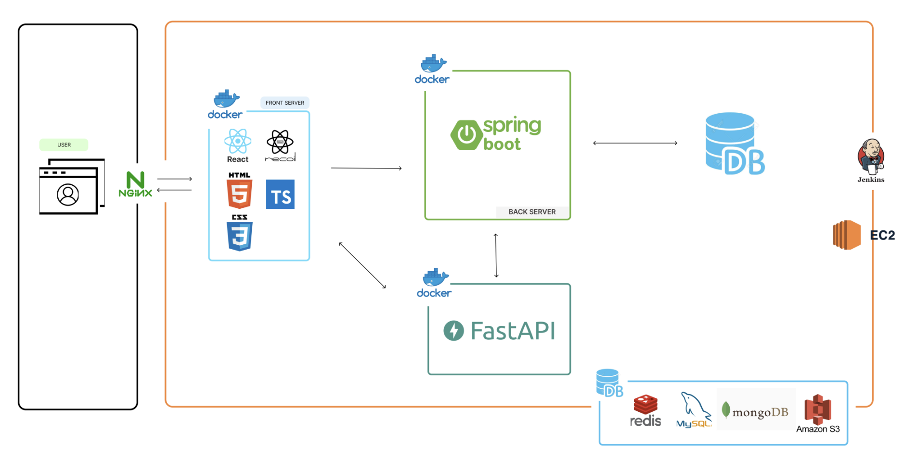
 

<h2>4️⃣ 기술 스택</h2> 

 

<h2>5️⃣ ERD</h2> 
 
 

<h2>6️⃣ API 명세서</h2>
<a href="https://mimiimmi.notion.site/API-4735c827e20b4f45a962cda5ec4b4653?pvs=4">API 명세서</a>
  

<h2>7️⃣ 서비스 화면</h2> 

### 메인페이지
- 비로그인시
  
  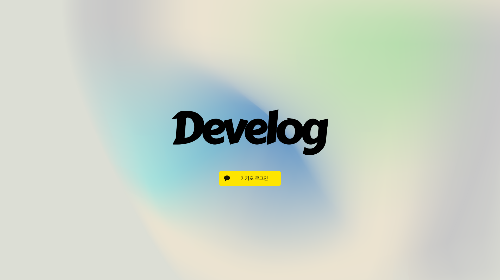
   
   
- 로그인 시
  
  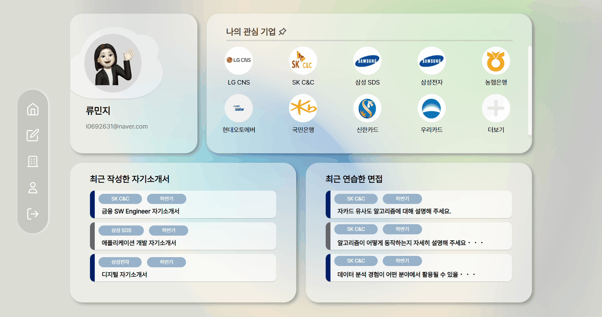

### 관심기업 리스트
- 기업등록하기
  
  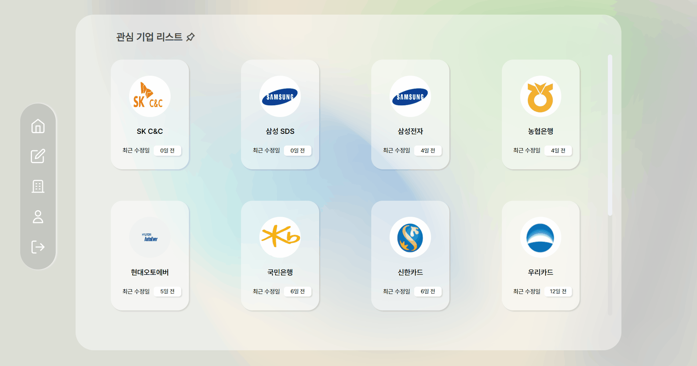 

### 지원정보 관리
- 관심 기업 페이지 내에서 입사 지원 정보 등록하기
- 직무명, 지원 시기 사용자 입력

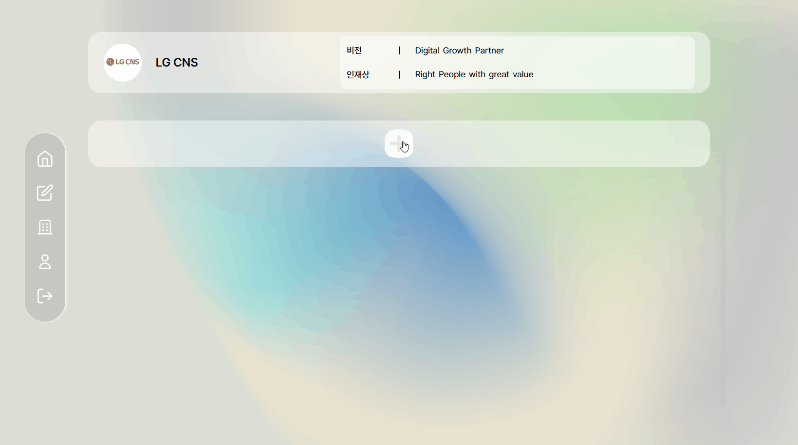

### 자기소개서 작성 
- 지원 기업 정보 제공
- 키워드 기반 유사 자소서 불러오기
- 개인 이력 및 포트폴리오 정보 조회
- 세가지 제공 기능을 참고하며 자기소개서 작성
- 자기소개서 문항별 키워드 태그 설정, 자동저장 제공
- 질문, 답변, 글자수 입력, 작성 진행률 체크 막대 제공

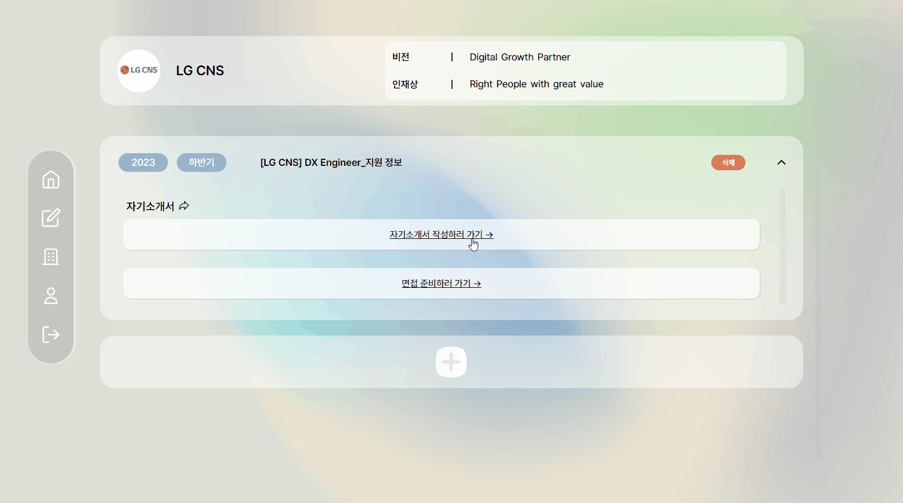

### GPT
- Open AI(GPT)를 활용한 자기소개서 답변 문맥 교정 기능 제공

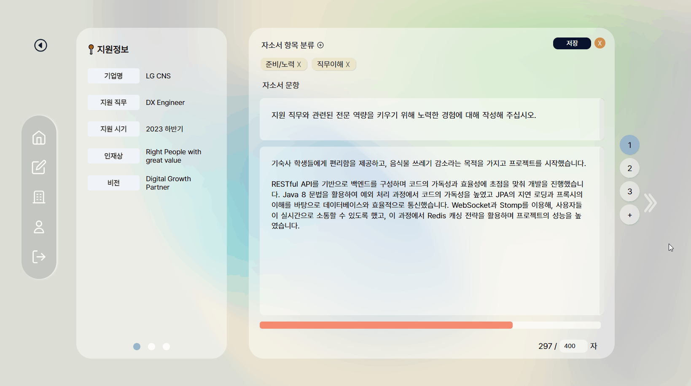

### 자기소개서 관리
- 관심 기업 페이지 내 자기소개서 조회 기능 제공
- 문항 별 키워드 및 질문, 답변 조회
- 문항 클릭 시 자기소개서 에디터 페이지 이동
- 자기소개서 수정 기능

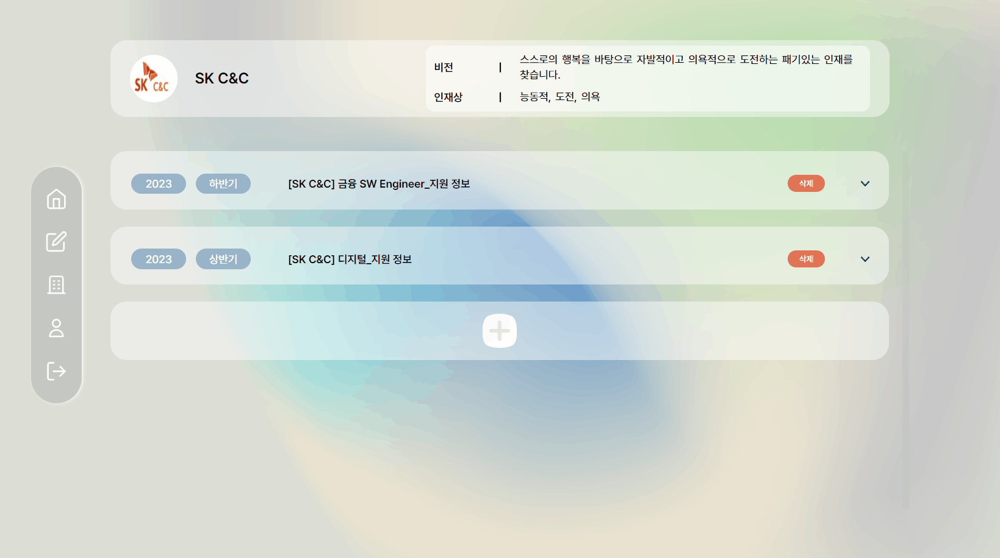

### 면접 연습하기

- 스크립트 작성 가능
- 음성 녹음 후 스코어링 기능 제공
- chatGPT를 통한 꼬리 질문 제공
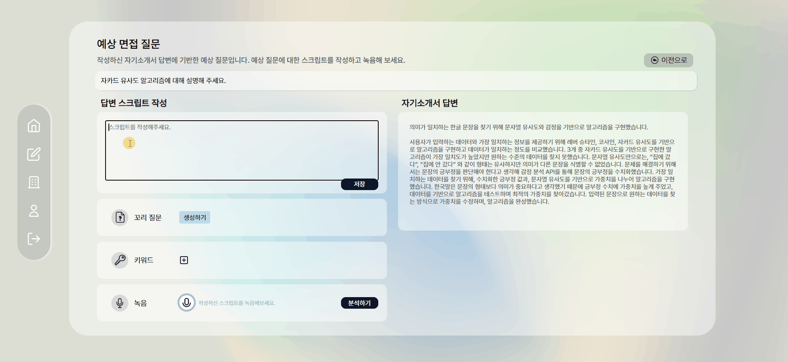

### 면접 예상질문 추출 & 질문 추가
- chatGPT를 통한 예상 질문 5개 제공
- 사용자가 원하는 질문 직접 추가 가능

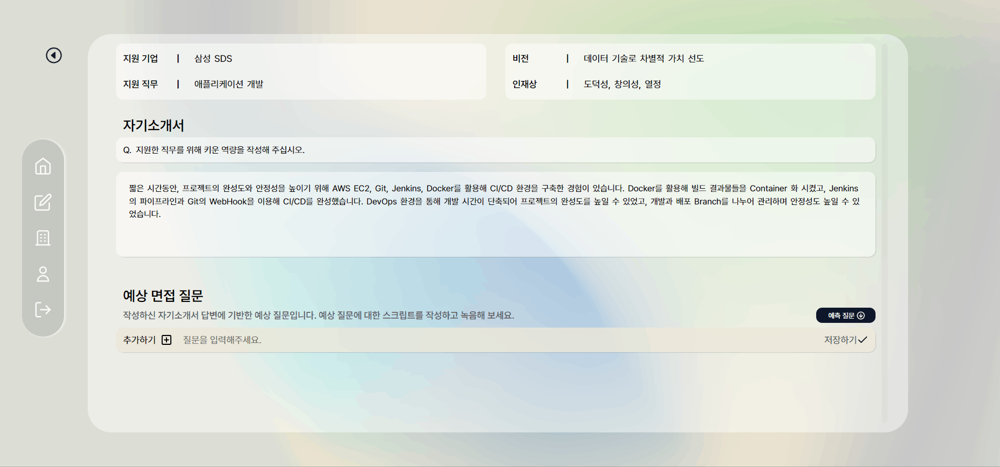

### 포트폴리오 조회 및 수정
- 학력, 경력, 자격증, 교육, 프로젝트, 어학 관련 정보 확인 및 수정 가능
- 자기소개서 작성할 때 좌측에 표시되는 데이터들.

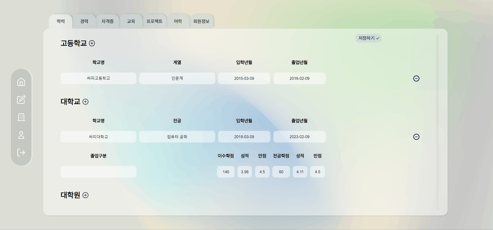
